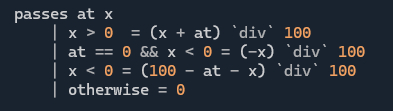
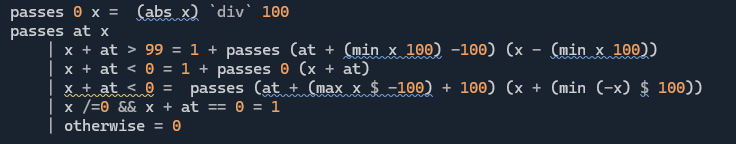

# Advent of Code 2025 solutions

Here are the attempts of [HappyGnome](https://github.com/HappyGnome) to solve the puzzles for [Advent of Code](https://adventofcode.com/2025) 2025 by Eric Wastl.

Language used: Haskell

# Commentary on solutions

## Day 1

In [this](https://adventofcode.com/2025/day/1) simple puzzle, we are given a series of rotations of a dial, in 100ths of a turn.

### Part 1
How many times do we land on 0 after a rotation? 

Solution:
* Simulate the rotations (simple use of modulo arithmetic) and count...

### Part 2
How many times do we pass 0?

Solutions:
* You could simulate each 100th of a turn and count (I didn't try it that way, but it would be a much quicker way to code a solution than the below); or
* you could work out how many times 0 was passed per rotation in the input in a simple way. Here we want to count crossings of 0 when starting at `at` and moving `x` 100ths:

    * The key is to realise that the formula for the first case (`x > 0`) is only correct when `0 <= at < 100`
    * "Reflecting" the same forumla (`at` -> `100 - at`, `x` -> `-x`) for `x < 0` works, but only when `0 <= 100 - at < 100`
    * So we have to deal with the case `at == 0` separately.

* Or... what I did at first:

Oh dear, better luck tomorrow!

# Project structure
* `NextPuzzle.bat/NextPuzzle.ps1` Used to update the `cabal` and `Main.hs` files each day (run the `.bat`)
* `AdventOfCode2025.cabal` is the project cabal file - specifying lib dependencies, project modules and options 
* `app/Main.hs` is the entry point for the app (simply runs `exec` in today's challenge module)
* `app/Common` contains some implementations of common algorithms and helper methods the author has built up when working on similar problems
* `app/Puzzles/Input` contains a folder per challenge attempted, each containing input and test inputs
* `app/Puzzles/Parts` contains one Haskell file (module) per puzzle

# Copyright
Unless otherwise stated, the content of this repo is Copyright (2025) of HappyGnome.

HappyGnome does not assert copyright on the puzzle inputs that are included as components of the respective solutions. Advent of Code may assert copyright on the use of these inputs in other cases. 
