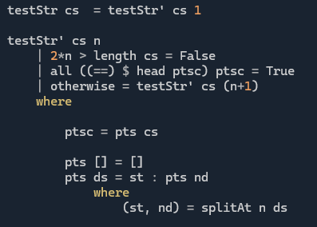
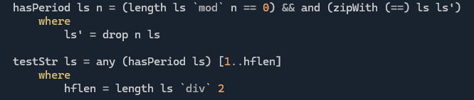

# Day 2 - A Repeating Problem

**SPOILERS AHEAD**

In [this](https://adventofcode.com/2025/day/2) simple puzzle, we are given a list pairs of numbers defining intervals of intergers. Each ordered pair is even in order (most orderly!). We need to look at repeating strings of digits for all integers in each interval.

## Part 1
**Problem:** Sum up all integers in all intervals where the digits (base 10) are of the form `a0 a1 ... an a0 a1 ... an`. I.e. the digits are periodic, period `n+1` , where the number has `2n+2` digits.

Solution:
* Definitely don't get stuck parsing the input - it's super simple.
* Definitely don't try to work with integers directly to detect repetitions in the digits (**who would do that?**). As much as it hurts to serialize numbers in the business logic, this is a problem about strings, not numbers.
* Once you have avoided the two idiocies above (**you're not an idiot, are you?**), just loop through each integer in any of the intervals cut their digit strings (base 10) in half and compare the two halfs. 

## Part 2
**Problem:** Sum up all integers whose digits repeat with any period for a whole number of periods. e.g. `a0 a1 a2 a0 a1 a2 ... a0 a1 a2`

**Solution(s):**
Maybe there's a better way, but probably we need a way to detect which integers have period `n` and just test each integer in play with all possible `n`'s.

* So, hack around until you get something that seems to detect periodic strings: 
    
    

* Then, later (when the time pressure is gone) repent. (All hail `zipWith`):

    
  
  What's going on here?
    * Local `ls'` is our string to test (`ls`) with `n` elements removed from the start
    * `zipWith (==)` compares each character in `ls'` with the corresponding one in `ls` creating a list of `Bool`'s 
        * Aside: this would work even if `ls` was an infinite list (**Haskelly!**)
    * `and` (only for finite lists... sad) checks whether each resulting `Bool` is `True`, which is equivalent to the `String` having period `n` 
    * *EDGE CASE:* We also only care about strings that contain full periods i.e. `a0 a1 a2 a0 a1 a2 ... a0` does not count. So we need to check that the string length is divisible by `n`. 
    * Finally, we just test the string for each possible periodicity ( we can safely stop at half the length of the string).
* *META THOUGHT:* Knowing that there are probably a lot of numbers with digits that repeat twice from part 1 (but also, longer periods are more likely than short ones in general for a random string of digits of a given length) maybe it would be more "performant" to check for periods in descending order from `hflen` instead... 
