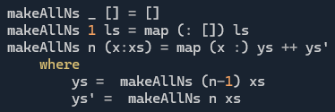
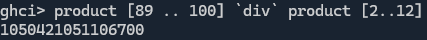
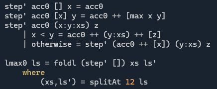

# Day 3 - Unwise Choices

**SPOILERS AHEAD**

In [this](https://adventofcode.com/2025/day/3) puzzle, we are given a list of long strings of digits (1-9). Each string has 100 digits.

## Part 1
**Problem:** For each string, find the substring of length 2 that gives the maximum value when converted to an integer. Sum this up over all the strings.

**Solution**:
* Check all pairs of digits (preserving the order in which they appear in the original string). Convert to an int and sum. Easy.
* I even have a function to help with this in my library of handy puzzle functions : `makeAllPairs`

## Part 2
**Problem:** Do the same, but for the substrings of length 12.

**Solution(s):**
It'll be the same, right? Just make a version of `makeAllPairs` that makes all substrings of length 12...

Something like:

(Is there a tail-recursive way to do this?)

Yep, all that's left is to hit run...

...

...

Hmmm...

Oh man! Turns out even modern hardware can't check `100 choose 12` substrings in a reasonable time. I can't believe I need [awareness of the performance](https://www.computerenhance.com/p/table-of-contents) of my code in 2025. 

Maybe it would help to have an algorithm that's `O(100)` (where `100` is the length of the whole string, and `12` is fixed)*:

Not very pretty (and maybe can be re-factored to use `:` (cons) more than `++` (concat)), but the idea is that:
1. `splitAt 12`:  We start by splitting the string into the first 12 digits, and the tail (88 digits initially)
2. Remove the first digit from the tail and append it to the end of the 12
3. `step'` : Remove the first of the 13 digits (left-to-right) that's less that the one that follows it
4. If nothing was removed, remove the 13th digit
5. Goto step 2 unless the tail is empty
6. The 12 digits you have left will give the highest value. **End of.**

*This is a joke -- if you haven't seen Big O notation, you still haven't. Can't say anything on *The Internet* these days...
