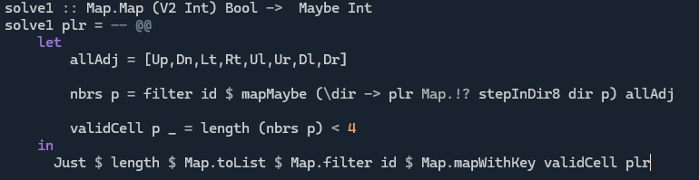
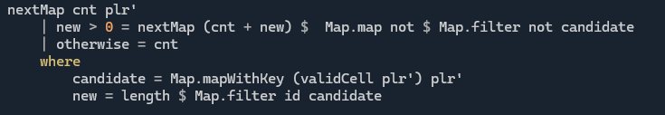

# Day 4 - A Lower Form of Life

**SPOILERS AHEAD**

In [this](https://adventofcode.com/2025/day/4) puzzle, we are given a grid of `.`s representing spaces and `@`s representing rolls of paper (or something... go read the puzzle). Point is, there are empty and non-empty cells in a grid...

We have some puzzles based on counting the number of non-empty neighbours of a cell. If you're a [legendary character](https://en.wikipedia.org/wiki/John_Horton_Conway), you can probably do some interesting stuff with this kind of setup. But we're not at that level.

This one is the simpler than the previous 3 puzzles, except we now have a 2D input to parse and, depending on your approach, some edge cases (as in, the edge of the grid). It's hard to overthink this one (but still possible to write bugs). 

## Part 1
**Problem:** How many filled cells have fewer than four filled neighbours?

**Solution**:
* I like to convert these grid inputs into a Haskell `Map`, with keys that are 2D vectors. In this case the values are just `Bool`.
* I have some standard code for reading and printing "sparse" grids in this form, and stepping around the grid.
* In languages where accessing array elements by index is a good idea (i.e. anything but Haskell) using arrays directly instead of maps might be more optimal. The only issue is implementing the bounds of the array.
* With the `Map` approach, an empty cell is the same as reading at coordinates off the grid - in either case the query returns a `Nothing`. 

1. (`nbrs :: (V2 Int) -> [Bool]`) We step in each direction (using the directions `[Up,Dn,...]`  and `stepInDir8` from my library)
2. `mapMaybe` is used to filter out any directions from `p` that take us to an empty cell, or off the grid
3. `filter id` is redundant since all values will be `True` or `Maybe` in this case. 

## Part 2
**Problem:** Empty all the cells you counted in part 1 and repeat the process until no more cells can be emptied.

**Solution:**
* A simple extension of part 1. Just filter out the cells that can be removed and repeat / recurse.
* My main issue was forgetting that after extracting the `Just False`s from `candidate` (i.e. all the cells to be filled next recursion), we need to `Map.map not` the result, since only the cells containing `True` are treated as filled.

