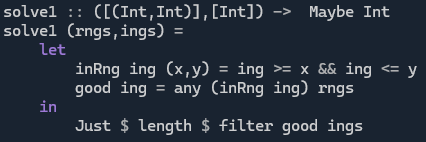

# Day 5 - Day 1 Was 4 Days Ago

**SPOILERS AHEAD**

In [this](https://adventofcode.com/2025/day/5) puzzle, we are given a list of intervals and a list of values. Not sure if a question like this came up in 2024, but it feels like a standard sort of question (the sort that everyone else can solve quickly).

## Part 1
**Problem:** How many of the numbers listed belong to one of the intervals listed?

**Solution**:
* Is there anything to do but check each number against each pair?
* Not really. 
* [Grug.](https://grugbrain.dev/)
* You could sort the intervals first to get a speed up, I suppose.

## Part 2
**Problem:** Ignore the set of numbers, just look at the intervals (I could never set questions that flowed nicely either...). How many distinct numbers lie in the union of all the intervals?

**Solution:**
* Given that my answer was in the order of `10^15`, brute force would have been a stupid thing to try first.
* For the second try, I used my goto solution for this type of problem:
    1. Sort the intervals (lexicographically - i.e. by lower limit then on ties by upper limit). (`O( n * log n )` typically, where `n` is the number of intervals. The size of the intervals doesn't theoretically affect the runtime!).
    2. Take the first interval remaining in the list.
    3. Continue taking intervals from the list (in order) until one does not intersect the union of the previous ones taken (or until the end of the list).
    4. Add the union of the extracted intervals to a list of pairwise-disjoint intervals.
        * At this point, because of the sorting, none of the intervals remaining in the list intersect this union
        * Recall that an interval `[a,b]` intersects `[c,d]` if and only if `a <= d` and `b >= c`. 
        * So, if `[a,b]` is before `[c,d]` in the list and the two do not intersect, then `b < c` which must also be true for all the intervals that follow `[c,d]`.
    5. If there are still intervals in the list, goto step 2. (Start building a new interval for the disjoint list).
    6. Sum the lengths of your disjoint intervals (don't forget to count the ends of the intervals - `end - start + 1`).

**Conclusions:**
* Brute force is fine on Day 1 to save some coding time, but is not worth trying in later rounds.
* ~~Non-stupid~~ "Smart" solutions are more fun anyway.
* Especially when you've already got one in mind, ready for a problem like this.
