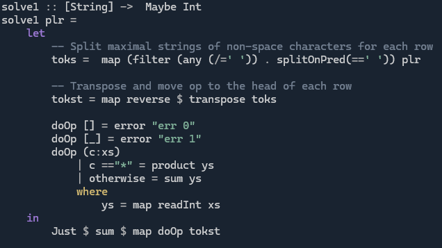

# Day 6 - Reading Between The Lines

**SPOILERS AHEAD**

In [this](https://adventofcode.com/2025/day/6) puzzle, we have to calculate sums and products of lists of numbers. The input is arranged in a grid, with the last row containing `+`s and `*`s for the operations to perform. E.g.

```
123 4    5 
25  339 87
10  27   62
*   +   *
```

I thought we said in [yesterday's commentary](day5.md) that it's not day 1 anymore. What's going on? Well... ahem... there is some fiddling to do to deal with the whitespace.

## Part 1
**Problem:** For each column of numbers, find their sum or product (woohoo commutative operations!). Sum this value for all columns.

**Solution**:
* Split each line on whitespace (note the extra spaces that make the columns align - we need to split on contiguous whitespaces, not on each `' '`).
* Since it's easier to access row-by-row, rather than column-by-column, we set aside the list of operations and transpose the grid of parsed numbers.
* Zip* with the row of ops and either take the product or sum of each row of ints depending on the op symbol that `zip` has paired it with.
* Sum the result.

*We even can things differently order so the `Int` parsing goes after the transpose, avoiding the need to remove the ops row and zip back:



## Part 2
**Problem:** The blocks of characters per op are the same, but the values to use are now in the columns of the blocks, to be read top to bottom:

```
123     3   +
25   -> 250 +
10      121
+           = 374
```
Crucially, we are to **take the columns right-to-left!**


**Solution:**

Take the columns left-to-right:

```
123     121  
25   -> 250
10      3  
```
That's just a transpose! And the order of the rows (columns in the input) doesn't matter, of course.

* Remove the ops row and transpose the remaining grid (nothing is parsed yet, it's just a grid of digits and spaces).

    ```
    [
        "121",
        "250",
        "3  ",
        "   ",
        "432",
        " 37",
        " 9 ",
        "   ",
        ...
    ]
    ```

* The numbers (still as strings) to input to each op are now separated by rows that are only whitespace. Split on these "empty" rows.

    ```
    [
        ["121", "250", "3  "],
        ["432", " 37", " 9 "],
        ...
    ]
    ```

* Convert each row for each op to an `Int` (the parse function ignores the remaining whitespace automatically).

    ```
    [
        [121, 250, 3],
        [432,  37, 9],
        ...
    ]
    ```

* `zip` the ops with the corresponding ops and conclude as for part 1.

    ```
    [
        ([121, 250, 3], '*'),
        ([432,  37, 9], '+'),
        ...
    ]
    ```
