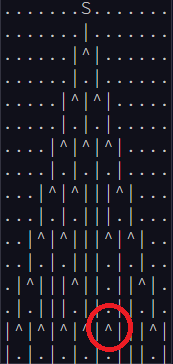
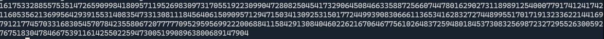
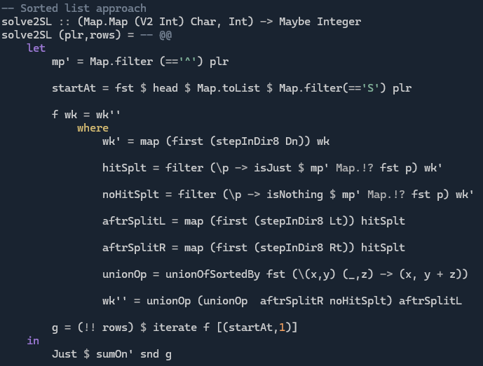

# Day 7 - Sided and Blind Tracked

**SPOILERS AHEAD**

In [this](https://adventofcode.com/2025/day/7) puzzle, we are given a grid containing tiles that are either "splitters", starting tiles (one instance at the top), or empty space.

A beam of \[details omitted\] is projected downwards from the starting tile. Beams end if they encounter a splitter, at which point two new beams continue downwards from the immediate left and right of the splitter. Multiple beams in the same tile still count as a single beam, for what I assume are reasons.  

## Part 1
**Problem:** How many splitters in the grid have an incoming beam?

**Solution**:
* Read the example again, (and again) there's one splitter without an input. If you don't spot it, it's very confusing how to arrive at the example answer (21), and you end up doubting your comprehension of the question, the correctness of the puzzle, and whether 5 cups of coffee counts as a good breakfast.

    

* A breadth-first approach works pretty well here:
    1. Create a list of tiles with a beam on the first row
    2. Given the list of beams on a row, look at the row below, and count the number of splitters below beams from the current row.
    3. There are 3 sources of beams for the new row:
        1. Beams continuing straight from the row above
        2. Beams to the right of a splitter that has an incoming beam
        3. Beams to the left of a splitter that has an incoming beam
    3. Because a cell with multiple beams is just treated as a cell with one beam, we must take a union of the cells from the three sources.
    4. Terminate the process once we get through all the lines. 
    5. The number of splitters with an incoming beam that we counted along the way is the solution.

## Part 2
**Problem:** After side stepping the more pseudo-physics ramblings, we need to work out how many distinct paths from the start to the bottom row of the grid are possible for a beam.   

**Solution:**
* It's not `2^n` or `2^m` where `m := `*number of splitters*  and `n := `*solution to part 1*. Those are ridiculously big numbers!

    

* Below is not my original implementation, but follows the same pattern. The difference (apart from the lack of squiggly lines) is that we use a sorted list instead of a `Map` to hold the working set. This seems to give the best performance of the methods I tried.
    
    

    * This is similar to the breadth-first approach to part 1. 
    * The difference is that for each beam tile we track the number of paths from the start to that tile. 
    * When taking the unions to de-duplicate our list of beam tiles on a row, we have to sum up the path counts from the rows feeding into it.
    * Once on a row below all the splitters (i.e. the last row of the grid) sum up the path counts for all beams on the row to get the solution.

**Side track**
* It was interesting to build out some performance testing code for this one, to test out the different data structures. You'll see that each part of today's problem has multiple solutions in `A2507.hs`.
* My timing code is based on the `QueryPerformanceCounter` for `Win32`. This is not as precise as going direct to the `C` intrinsics that API method wraps (e.g. versions of `rdtsc` or its equivalents for different compilers and OSs), but `getCurrentTime` in Haskell has limited precision, so it's a start.
* `getCPUTime` has terrible precision on my setup: something like 16ms resolution. Certainly not useful for performance tests of a single call to a method.

* I found that my original approach using `Map` to hold the working set of beams in a row performed quite well. Despite being a bit of a mess in its original form, it was only beaten by the sorted list approach.
* Approaches that relied on concatenating, sorting and combining beams sharing a tile every step were significantly slower than using `Map`s here.
* The direct recursive approach (e.g. see [Jonathan Paulson's](https://github.com/jonathanpaulson/AdventOfCode/blob/master/2025/7.py) solution in Python) was also quite slow <u>in my implementation</u>.
* Note that in Python there is apparently an `@cache` decorator that can add some *memoization* under the hood. This is a neat trick, but it makes it look like the problem admits a trivial depth-first approach. Doing the recursion naively will not result in an answer any time soon!
    
    
