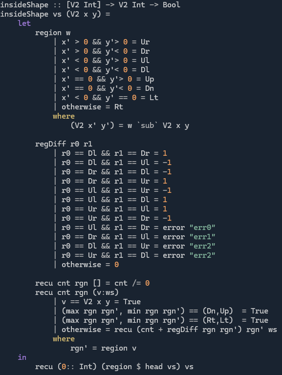

# Day 9 - Wind Up

**SPOILERS AHEAD**

In [this](https://adventofcode.com/2025/day/9) puzzle, we are given a sequence of a few hundred points in the plane (2D, with integer coordinates).

## Part 1
**Problem:** Find the area of the largest rectangle with opposite corners belonging to the list.

**Solution**:
No Christmas miracles needed for this one. Just:
* Make a list of pairs of points
* Find the area of the rectangle defined by each pair

## Part 2
**Problem:** Consider the sequence of points taken in order. Each pair makes an edge, and adding a final edge back to the start makes a big loop. What is the largest rectangle with opposite corners in the  list (as in Part 1), which is contained in the region enclosed by the loop (including the edges).  

**Solution:**
* It is not clear what can be assumed about the loop:
    1. Are all the edges either horizontal or vertical?
    2. Can the curve double back on itself? E.g. (0,0), (0,10), (0,5)
    3. Are edges allowed to run parallel to each other with no gap? E.g. (0,0), (0,10), (1,10), (1,5)
    4. Is the path [simple](https://en.wikipedia.org/wiki/Curve)? I.e. can it cross itslef?

* Assumption 1 seems reasonable, given the worked example in the question text. Assuming points 2-4 does not seem justified.

* In this case we need to be able to detect membership of the shape. Time to break out the [winding numbers](https://en.wikipedia.org/wiki/Winding_number):
    
    

    * The recursive part (`recu`) caclulates `cnt` which is the winding number or the curve around the given point
    * If the winding number is non-zero (or the point is in an edge) then the point is enclosed by the curve (albeit the curve doesn't necessarily wind around all points in teh same direction)
    * The sign of the winding number in this implementation may be incorrect!
    * It's a bit of a mess, but at least we could look at simple discrete cases because of assumption 1. Maybe there's a tidier way to write the calculation.

* Testing every point in every rectangle for membership of the enclosed region would take a long time...
* Instead, let's just check points adjacent to the curve. A rectangle contains a point not enclosed by the curve if and only if it contains one of these points (I claim - not 100% sure this is true - just using the ol' math gut).
* This is at least feasible, but still takes 45 seconds to run!
* Some sort of spatial indexing might help to check if the small(er) set of bad points intersects a rectangle in less time.

### Bad assumptions, better algorithms:
* It turned out later that a simpler approach still gives the correct answer (it still takes 16s though).
* In this approach we just check whether any edge crosses into or through the interior of the rectangle.
* If we were given assumptions 2-4 in the question, we could safely have solved it without needing to find any winding numbers (but wouldn't that have been lame?)
    * Indeed, it seems retrospectively that we can use assumptions 2, 3 & 4 so that every edge has exterior points on one side and interior points on the other, making the crude second approach work just as well.

Examples of inputs where the simple approach doesn't work, but the winding number based one does:
* Double back (with self-intersection)

    ```
    0,0
    5,0
    5,5
    5,0
    10,0
    10,10
    0,10
    ```
    ```
    X#########X
    #.........#
    #.........#
    #.........#
    #.........#
    #....X....#
    #....#....#
    #....#....#
    #....#....#
    #....#....#
    X####X####X
    ```

* Double back (no self-intersection)

    ```
    0,0
    4,0
    4,5
    5,5
    5,0
    10,0
    10,10
    0,10
    ```

    ```
    X#########X
    #.........#
    #.........#
    #.........#
    #.........#
    #...XX....#
    #...##....#
    #...##....#
    #...##....#
    #...##....#
    X###XX####X
    ```
* Non-simple (All except the `_` cells are enclosed - largest rectangle is 12 x 8. However the lame algorithm only finds the rectangle marked by `/`).

    ```
    0,0
    13,0
    13,7
    2,7
    2,5
    2,2
    11,2
    11,5
    0,5
    ```

    ```
    __X##########X
    __#..........#
    X#X########X.#
    #.#////////#.#
    #.#////////#.#
    #.X########X.#
    #............#
    X############X
    ```

### Questions:
* Is there a nicer way to find whether a curve like this encloses a rectangle? A sort of winding number around a rectangle, rather than a point?


